# AUTOMATED FUEL STATION FOR OPTIMUM CUSTOMER EXPERIENCE

Project Ideation 

## Problem Statements

**This project is tackling three major issues Indian vehicle owners and Fuel
stations are suffering with:**

**1. Long and Cumbersome lines in front of fuel stations** :

Both the vehicle owners and fuel station owners doesn't want these long lines as
no one wants to wait an hour just to fill up the tank which is merely 2-3 minute
job. On the other hand long lines can cause various customers to think using
other station instead of standing in a line, which in turn affects business.

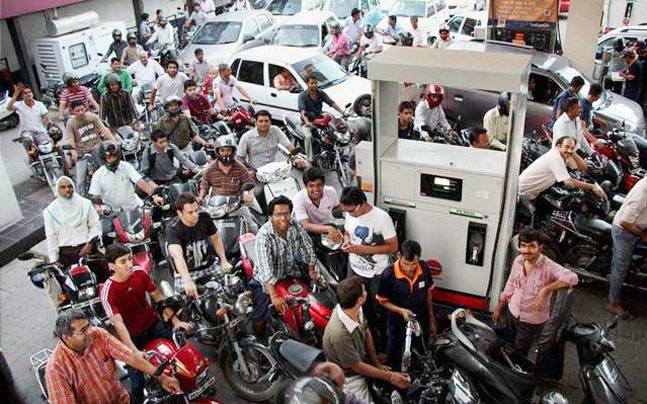

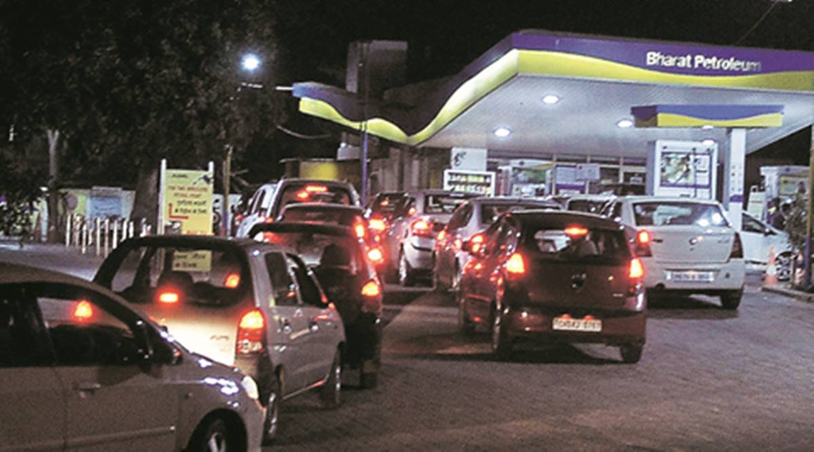

**2. Over utilization and Under utilization of Fuel stations**:

According to many reports the stations inside the busy area of the city are over
utilized, and those which are in remote areas, outskirts of the city are
underutilized. Thus resulting in a huge class imbalance. 

**3. Enhanced Customer Experience**:
Almost every industry in our country is gone digital and can provide services in
more customized and sophisticated manner but only the oil and gas industry
still lacking behind and we are still not making any progress to make the
customer experience better.

## Proposed Solution

#### We are proposing 2 products/services.

1. **A web-app**

2. **A Microprocessor based hardware decice** : This will perform two functions
    
- Automatic Number Plate Recognition(ANPR) : 
    
- Time and Rush Estimate 
    

## Automatic Number Plate Recognition:

**Basics of Number Plate Detection**

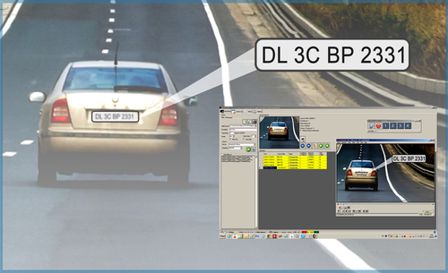

**How this will be executed at Fuel Station**

**Original Code Block Output**

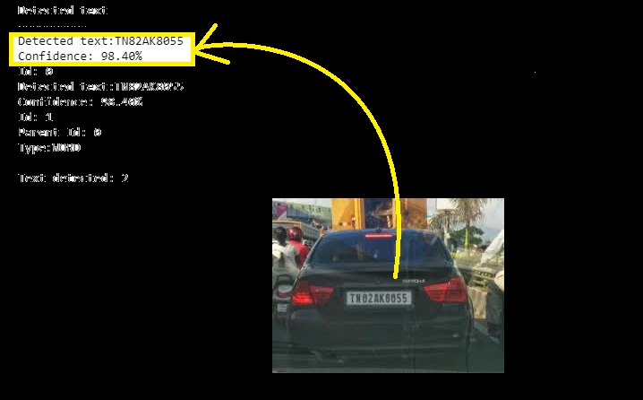

**Block Diagram of Algorithm**

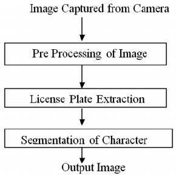

**Why we are Doing this ?**

- The Answer is that : 1.) We need to create a customer database for better service.
                       2.) Need to figure out the customer that are visiting a particular fuel station more frequently.
                       3.) To solve the Under utilization and Over utilization problem 

### Time and Rush Estimate

## Now let's see how the Whole Process Looks like:

## 1. How This Works ?

**COMPLETE BLOCK DIAGRAM OF THE PROJECT**

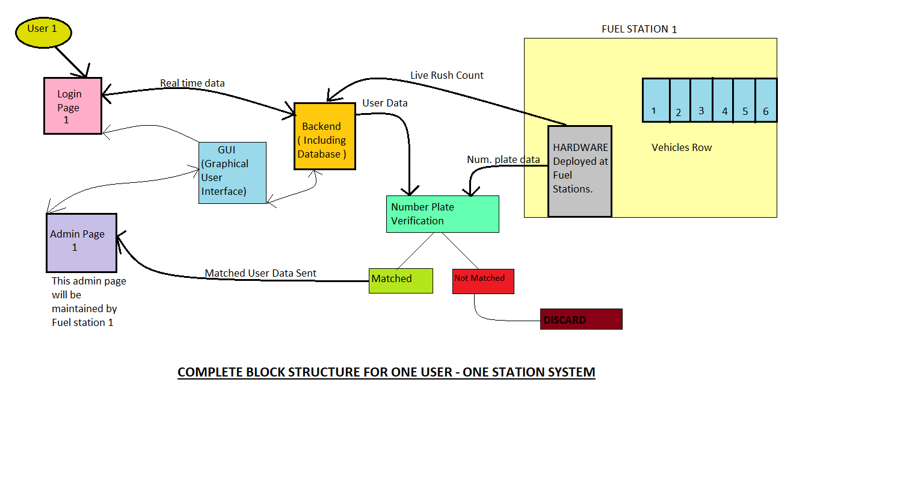

### STEP 1:

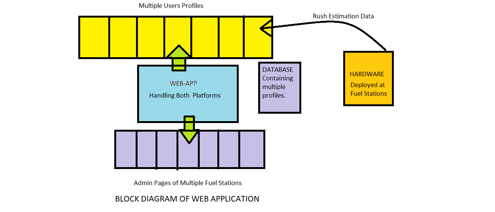

**EXPLANATION** 

- The web page displayed here is a frontend GUI which will interact with User profiles(Which will be generated after a user created 
  an account on the website
  
- The website also interacts with the multiple Admin pages(will be created for fuel station owners).

- Hardware : Raspberry pi + Camera + Ultrasonic Sensors  

- The data collected by the hardware device will be fetched and fed to the website which then directly displayed on the profiles of the   users.

### STEP 2:

**DATABASE and HARDWARE Communication**

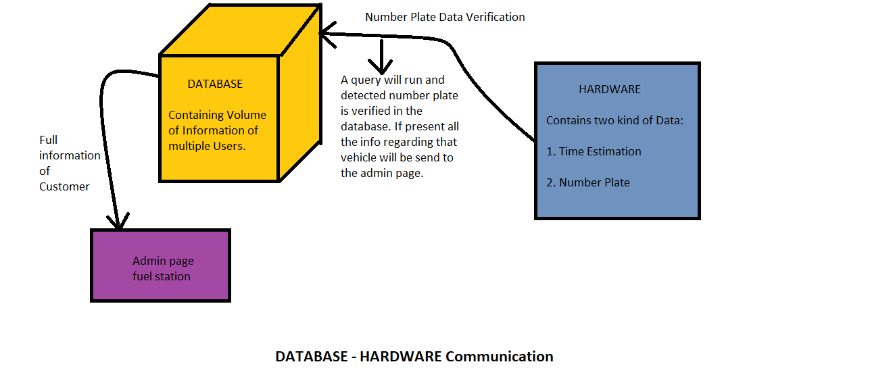

**EXPLANATION**

- Database has the data of all the users and the fuel stations.

- Once the ANPR is done we have a number plate text. This text is run through the Database and will try to find the number plate 
  matches with this. Once a match is found the ehole data is sent to the Admin page of the fuel station from where the data has came.

- SIMPLE!!

## Now let's visit the Web Page:

**Web-App**

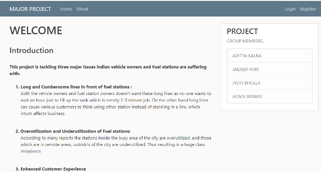

- This is the home page of our web app.

- See carefully at the top right corner, there is a Login(For Existing Users) and Register(For new Users) options.

**Registration Page[For New Users]**

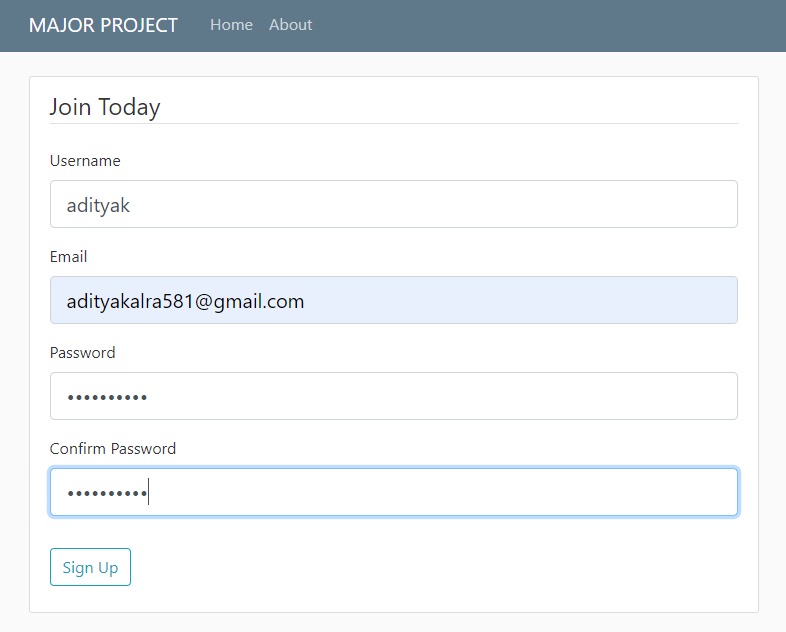

**Login Page**

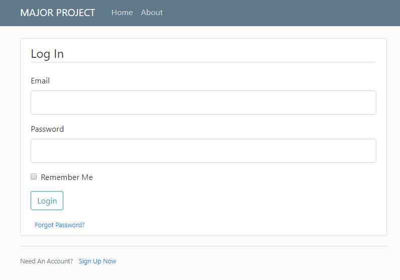

**Q. Why would anyone want to Register or Login?**

**ANS** : **Benefits** of Creating an Account:
 
**For Customers:** 

1) Will receive real time data of how busy a particular fuel station is and how much time it will take to provide                           the service.(Hence solving problem number 1 of long lines)

2) Better service and customer experience as the service providers know there customer.
 
**NEED** 

**For Client(Fuel station Owners)** :
  
- For collection of data and customer verification it is mandatory.
  
  
## HARDWARE 

**Raspberry Pi Integration**

- This is an old image, Raspberry Pi integrated with camera, Desktop, ethernet, keyboard, mouse.
- The setup is for the testing of ANPR
[There is push button integrated with the GPIO along with LED for controlling the camera with push button which is not included in the project]

### TASKS Segregation

#### Tasks Completed:

1. Website : Home,About,Login,Registration pages completed. Database is created, integration of database with website is done.
             Authentication is also completed i.e no spam or fraudulent email will be accepted, passwords will be hased when sent to the              database.
             
2. Hardware : Setup is complete, Raspberry pi is running, camera is capturing image and live stream is recorded and displayed.

3. Automatic Number Plate Recognition : Completed and tested. The algorithm is working with high accuracy.

4. Time and Rush Estimation : Code is completed.

#### Pending Tasks:

1. Website : Profile page of user,Admin page for client and deployment of website.

2. Time and Rush Estimation : Code deployment and Testing.

************************************************************************
