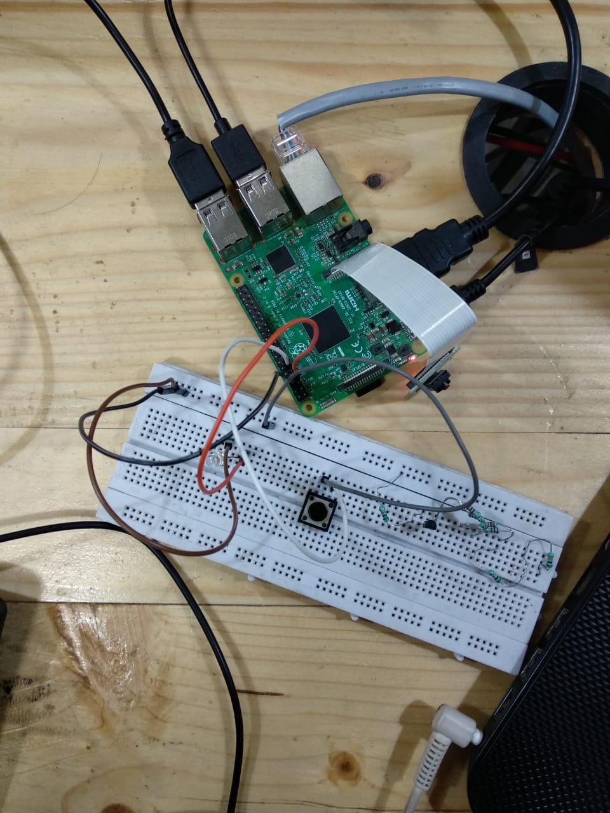
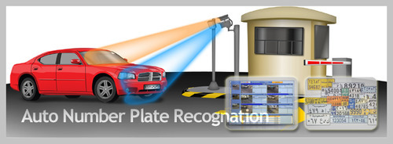

# Automated-fuel-stations
Major Project

## Problem Statements

- This project is tackling three major issues Indian vehicle owners and Fuel
stations are suffering with:

**1. Long and Cumbersome lines in front of fuel stations** :

Both the vehicle owners and fuel station owners doesn't want these long lines as
no one wants to wait an hour just to fill up the tank which is merely 2-3 minute
job. On the other hand long lines can cause various customers to think using
other station instead of standing in a line, which in turn affects business.

**2. Over utilization and Under utilization of Fuel stations**:

According to many reports the stations inside the busy area of the city are over
utilized, and those which are in remote areas, outskirts of the city are
underutilized. Thus resulting in a huge class imbalance. 

**3. Enhanced Customer Experience**:
Almost every industry in our country is gone digital and can provide services in
more customized and sophisticated manner but only the oil and gas industry
still lacking behind and we are still not making any progress to make the
customer experience better.

## Proposed Solution

- We are proposing 2 products/services.

1. A web-app

2. A Microprocessor based hardware decice

## How This Works ?

**DATABASE and HARDWARE Communication**

**Web-App**

This is the home page of our web app.

**Registration Page**

**Login Page**

**Raspberry pi Hardware Device**

## Automatic Number Plate Recognition:

**Basics of Number Plate Detection**

**How this will be executed at Fuel Station**

**Original Code Block Output**

**Block Diagram of Algorithm**

### TASKS Segregation

#### Tasks Completed:

1. Website : Home,About,Login,Registration pages completed. Database is created, integration of database with website is done.
             Authentication is also completed i.e no spam or fraudulent email will be accepted, passwords will be hased when sent to the              database.
             
2. Hardware : Setup is complete, Raspberry pi is running, camera is capturing image and live stream is recorded and displayed.

3. Automatic Number Plate Recognition : Completed and tested. The algorithm is working with high accuracy.

4. Time and Rush Estimation : Code is completed.

#### Pending Tasks:

1. Website : Profile page of user,Admin page for client and deployment of website.

2. Time and Rush Estimation : Code deployment and Testing.

************************************************************************
